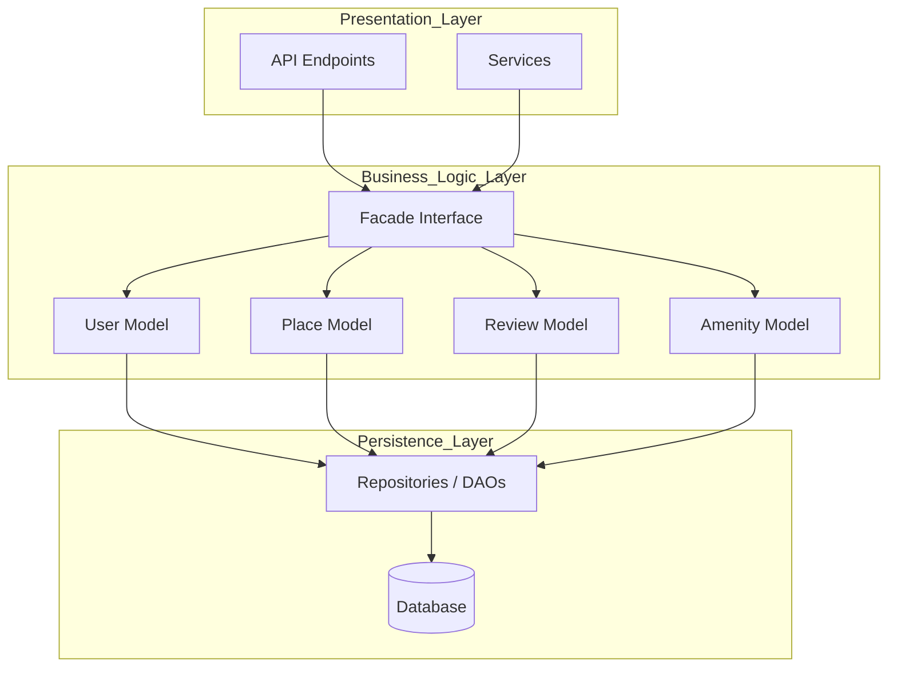
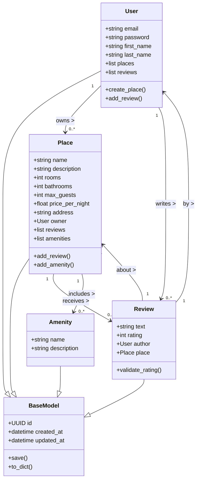
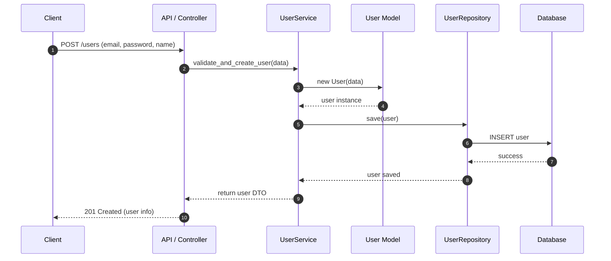
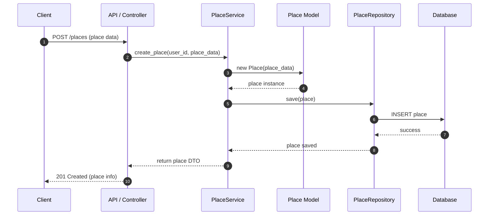
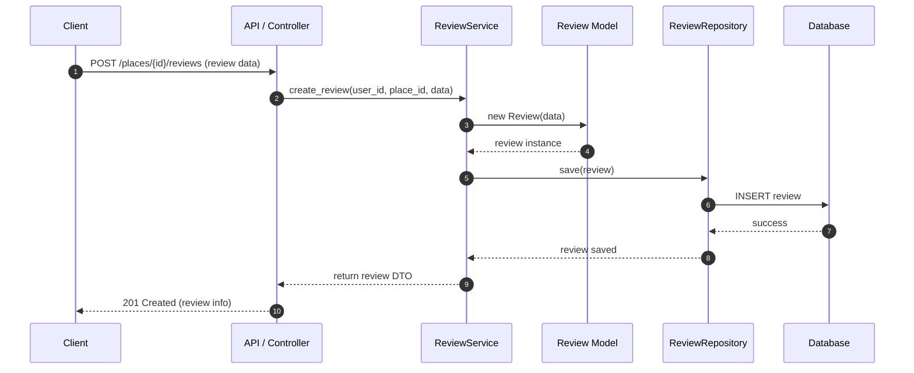
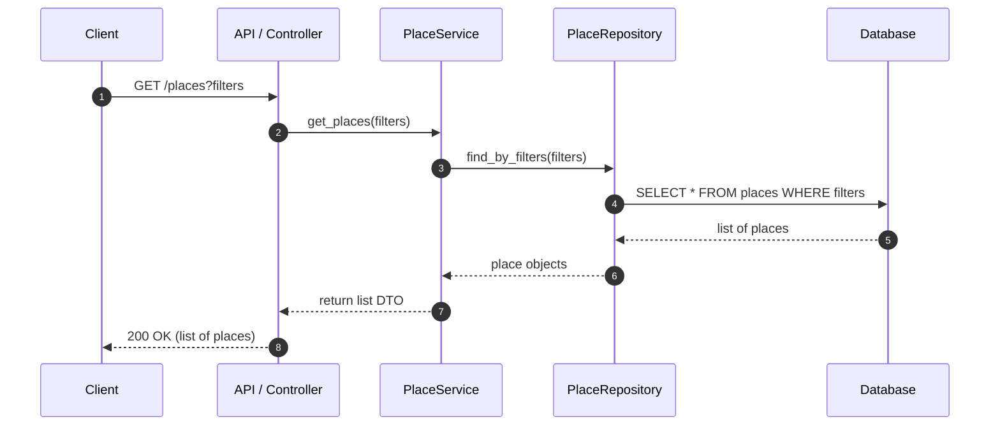

---

# **HBnB Technical Architecture Document**

## **1. Introduction**

### **Purpose of this Document**
This document compiles and organizes the technical architecture of the **HBnB** project, including:

- The High‑Level Package Diagram  
- The Detailed Class Diagram for the Business Logic Layer  
- The Sequence Diagrams for key API calls  

Its purpose is to serve as a **blueprint** for implementation, providing a clear view of the system’s structure, responsibilities, and interaction flows.

### **Project Overview**
HBnB is an accommodation‑listing platform where users can:

- Register an account  
- Create property listings (places)  
- Submit reviews  
- Browse and filter available places  

The architecture follows a **layered design**:

- **Presentation Layer:** API / Services  
- **Business Logic Layer:** Facade + Domain Models  
- **Persistence Layer:** Repositories + Database  

This document explains how these layers interact and how the system is structured internally.

---

## **2. High‑Level Architecture**

### **2.1 High‑Level Package Diagram (Mermaid)**

### **2.2 Architecture Explanation**

#### **Presentation Layer**
- **API:** Exposes REST endpoints to clients.  
- **Services:** Implement application‑level logic for use cases (e.g., `UserService`, `PlaceService`).

#### **Business Logic Layer**
- **Facade:** Single entry point for the Presentation Layer.  
- **Models:** Core domain entities (`User`, `Place`, `Review`, `Amenity`).

#### **Persistence Layer**
- **Repositories:** Abstract data access operations.  
- **Database:** Stores persistent data.

### **Why the Facade Pattern?**
- Reduces coupling between API and domain models  
- Centralizes validation and orchestration  
- Allows internal changes without affecting the API  

---

## **3. Business Logic Layer – Class Diagram**

### **3.1 Class Diagram (Mermaid UML)**

### **3.2 Entity Explanations**

#### **BaseModel**
- Provides shared attributes: `id`, `created_at`, `updated_at`  
- Provides shared methods: `save()`, `to_dict()`  
- Ensures consistency across all domain entities  

#### **User**
- Represents a platform user  
- Attributes: email, password, first/last name  
- Relationships:  
  - Owns many `Place` objects  
  - Writes many `Review` objects  
- Methods: `create_place()`, `add_review()`  

#### **Place**
- Represents a property listing  
- Attributes: name, description, rooms, bathrooms, max guests, price, address  
- Relationships:  
  - Owned by a `User`  
  - Has many `Review` objects  
  - Has many `Amenity` objects  
- Methods: `add_review()`, `add_amenity()`  

#### **Review**
- Represents a user’s review of a place  
- Attributes: text, rating  
- Relationships:  
  - Written by a `User`  
  - About a `Place`  
- Method: `validate_rating()`  

#### **Amenity**
- Represents a feature or service (WiFi, pool, etc.)  
- Attributes: name, description  
- Relationship: many‑to‑many with `Place`  

---

## **4. API Interaction Flow – Sequence Diagrams**

### **4.1 User Registration**

---

### **4.2 Place Creation**

---

### **4.3 Review Submission**

---

### **4.4 Fetching a List of Places**

---

## **5. How All Diagrams Fit Together**

- The **High‑Level Package Diagram** shows the overall layered architecture.  
- The **Class Diagram** details the internal structure of the Business Logic Layer.  
- The **Sequence Diagrams** show how real API calls flow through all layers.  

Together, they provide a complete architectural blueprint for HBnB.

---
