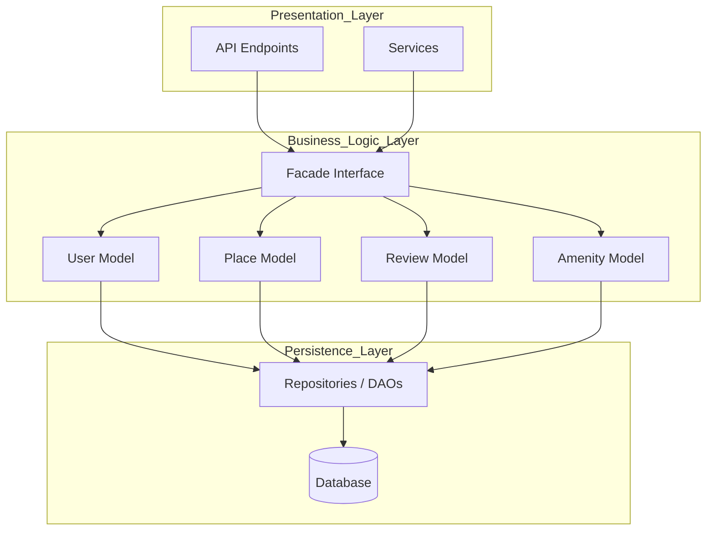

```mermaid
%% HBnB High-Level Package Diagram

flowchart TB
    subgraph Presentation_Layer
        API[API Endpoints]
        Services[Services]
    end

    subgraph Business_Logic_Layer
        Facade[Facade Interface]
        UserModel[User Model]
        PlaceModel[Place Model]
        ReviewModel[Review Model]
        AmenityModel[Amenity Model]
    end

    subgraph Persistence_Layer
        Repositories[Repositories / DAOs]
        Database[(Database)]
    end

    API --> Facade
    Services --> Facade
    Facade --> UserModel
    Facade --> PlaceModel
    Facade --> ReviewModel
    Facade --> AmenityModel
    UserModel --> Repositories
    PlaceModel --> Repositories
    ReviewModel --> Repositories
    AmenityModel --> Repositories
    Repositories --> Database
```