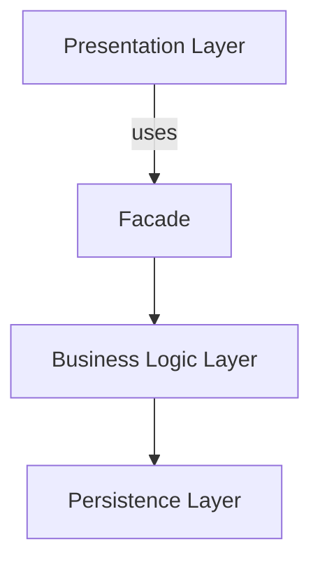
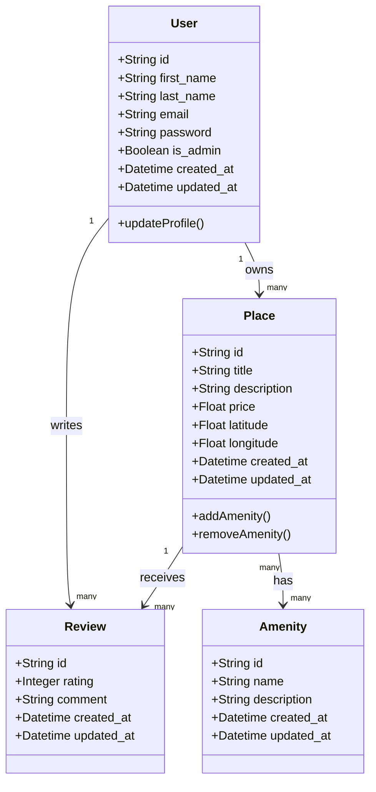
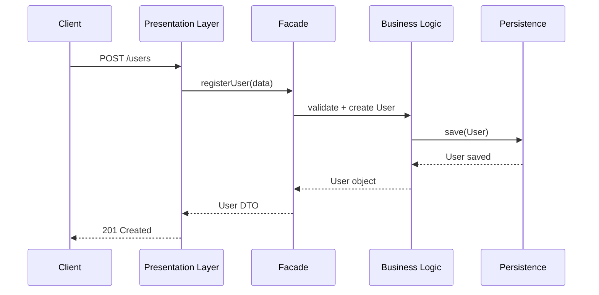
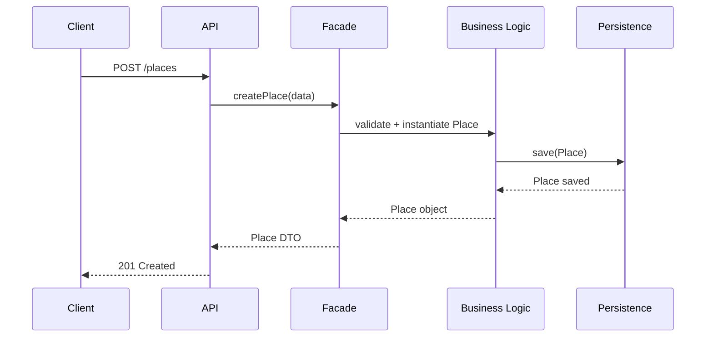
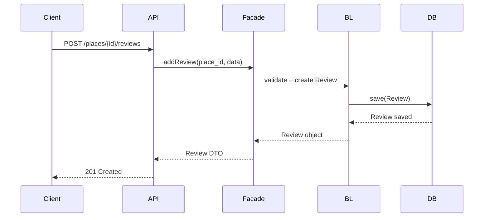
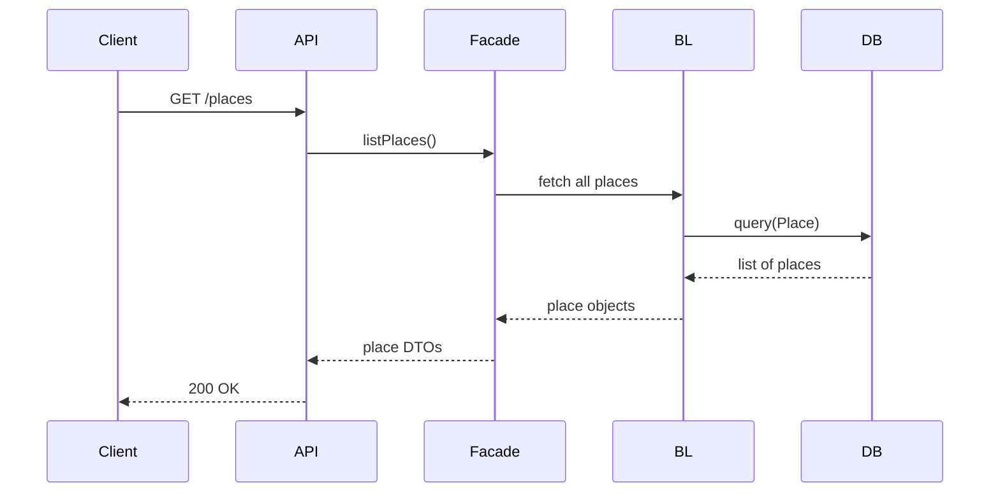

---

# HBnB Evolution — Part 1: Technical Documentation

This document provides the **technical foundation** for the HBnB Evolution application, a simplified AirBnB‑like system.  
It defines the architecture, business rules, UML diagrams, and interaction flows that will guide implementation in later phases.

---

##    1. Context and Objective

Part 1 focuses on producing **comprehensive technical documentation** that describes:

- The **overall architecture** of the HBnB Evolution system  
- The **business logic design** for core entities  
- The **interactions between layers**  
- The **UML diagrams** required for implementation in Parts 2 and 3  

This documentation ensures a clear, consistent, and scalable foundation for the application.

---

##    2. Problem Description

HBnB Evolution is a simplified property‑rental platform where users can:

### **User Management**
- Register and authenticate  
- Update profile information  
- Be identified as **regular users** or **administrators**  
- Be deleted  

### **Place Management**
- Create, update, delete, and list places  
- Each place includes:
  - Title  
  - Description  
  - Price  
  - Latitude & longitude  
  - Amenities  
- Places belong to a **user owner**

### **Review Management**
- Users can leave reviews on places they visited  
- Each review includes:
  - Rating  
  - Comment  
- Reviews can be created, updated, deleted, and listed **by place**

### **Amenity Management**
- Amenities have:
  - Name  
  - Description  
- Amenities can be created, updated, deleted, and listed  
- Places can have **multiple amenities**

### **Global Requirements**
- Every entity has a **unique ID**  
- Every entity stores:
  - `created_at`
  - `updated_at`

---

##    3. Business Rules and Requirements

### **User**
| Attribute | Description |
|----------|-------------|
| first_name | String |
| last_name | String |
| email | Unique string |
| password | Hashed string |
| is_admin | Boolean |
| created_at / updated_at | Datetime |

### **Place**
| Attribute | Description |
|----------|-------------|
| title | String |
| description | String |
| price | Float |
| latitude / longitude | Float |
| owner_id | FK → User |
| amenities | List of Amenity |
| created_at / updated_at | Datetime |

### **Review**
| Attribute | Description |
|----------|-------------|
| rating | Integer (1–5) |
| comment | String |
| user_id | FK → User |
| place_id | FK → Place |
| created_at / updated_at | Datetime |

### **Amenity**
| Attribute | Description |
|----------|-------------|
| name | String |
| description | String |
| created_at / updated_at | Datetime |

---

##    4. Architecture Overview

HBnB Evolution follows a **three‑layer architecture**:

### **1. Presentation Layer**
- REST API endpoints  
- Request/response handling  
- Input validation  
- Serializers / DTOs  

### **2. Business Logic Layer**
- Core domain models  
- Entity relationships  
- Validation rules  
- Application services  
- Facade pattern to expose unified operations  

### **3. Persistence Layer**
- Database access  
- Repositories / DAOs  
- CRUD operations  
- ORM or raw SQL (defined in Part 3)

### **Communication Pattern**
- Presentation Layer → **Facade** → Business Logic → Persistence  
- Persistence returns data → Business Logic → Presentation → Client  

---

##    5. High‑Level Package Diagram (UML)

Below is the conceptual structure (Mermaid‑compatible):

---

##    6. Detailed Class Diagram — Business Logic Layer

---

##    7. Sequence Diagrams for API Calls

### **1. User Registration**

---

### **2. Place Creation**

---

### **3. Review Submission**

---

### **4. Fetching List of Places**

---

##    8. Documentation Compilation

Your final technical documentation must include:

- High‑level package diagram  
- Detailed class diagram  
- Four sequence diagrams  
- Explanatory notes for each diagram  
- Clear mapping between business rules and UML elements  
- Architecture explanation and layer responsibilities  

This document becomes the **blueprint** for:

- Part 2: API Implementation  
- Part 3: Database & Persistence Layer  

---

##    9. Resources

### UML Basics
- *OOP – Introduction to UML*

### Package Diagrams
- *UML Package Diagram Overview*  
- *UML Package Diagrams Guide*

### Class Diagrams
- *UML Class Diagram Tutorial*  
- *How to Draw UML Class Diagrams*

### Sequence Diagrams
- *UML Sequence Diagram Tutorial*  
- *Understanding Sequence Diagrams*

### Diagram Tools
- Mermaid.js  
- draw.io  

---

### Author

- **Eugenio Martinez**  

