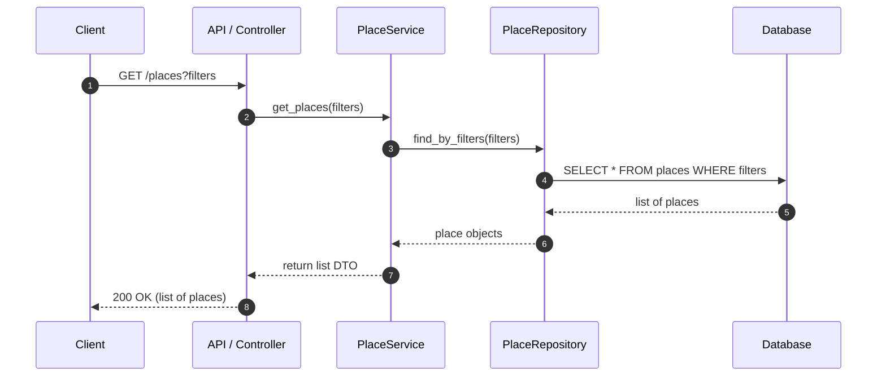

```mermaid
sequenceDiagram
    autonumber
    participant Client
    participant API as API / Controller
    participant Service as PlaceService
    participant Repo as PlaceRepository
    participant DB as Database

    Client->>API: GET /places?filters
    API->>Service: get_places(filters)
    Service->>Repo: find_by_filters(filters)
    Repo->>DB: SELECT * FROM places WHERE filters
    DB-->>Repo: list of places
    Repo-->>Service: place objects
    Service-->>API: return list DTO
    API-->>Client: 200 OK (list of places)
```