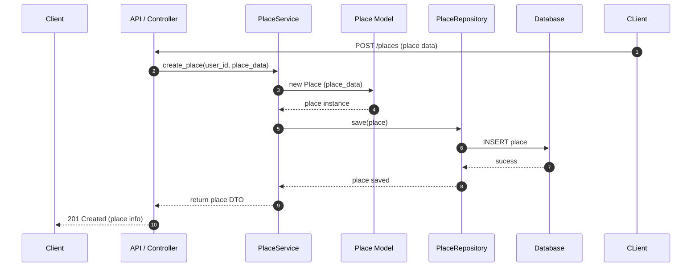

```mermaid
sequenceDiagram
	autonumber
	participant Client
	participant API as API / Controller
	participant Service as PlaceService
	participant Model as Place Model
	participant Repo as PlaceRepository
	participant DB as Database

	CLient->>API: POST /places (place data)
	API->>Service: create_place(user_id, place_data)
	Service->>Model: new Place (place_data)
	Model-->>Service: place instance
	Service->>Repo: save(place)
	Repo->>DB: INSERT place
	DB-->>Repo: sucess
	Repo-->>Service: place saved
	Service-->>API: return place DTO
	API-->>Client: 201 Created (place info)
```