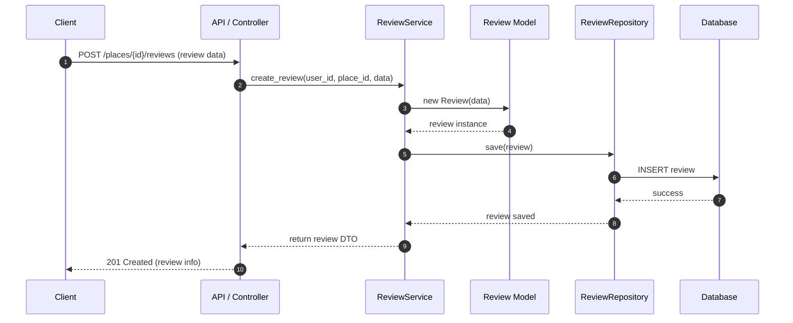

```mermaid
sequenceDiagram
    autonumber
    participant Client
    participant API as API / Controller
    participant Service as ReviewService
    participant Model as Review Model
    participant Repo as ReviewRepository
    participant DB as Database

    Client->>API: POST /places/{id}/reviews (review data)
    API->>Service: create_review(user_id, place_id, data)
    Service->>Model: new Review(data)
    Model-->>Service: review instance
    Service->>Repo: save(review)
    Repo->>DB: INSERT review
    DB-->>Repo: success
    Repo-->>Service: review saved
    Service-->>API: return review DTO
    API-->>Client: 201 Created (review info)
```