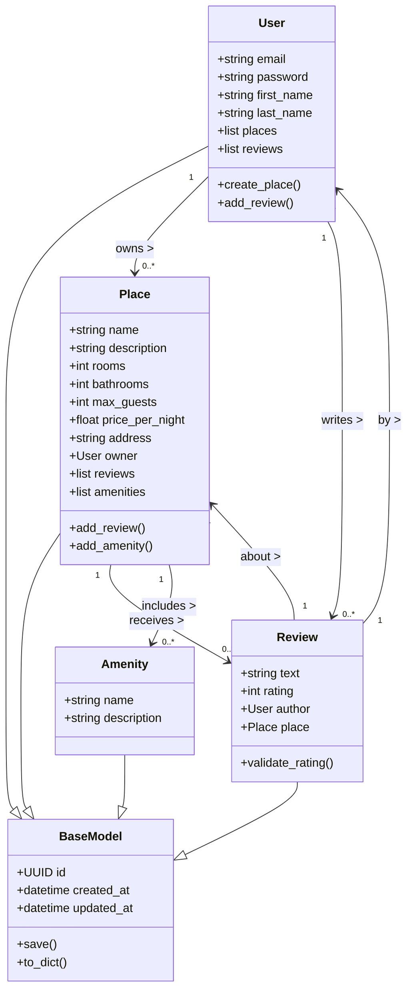

```mermaid
	classDiagram
    %% Base class
    class BaseModel {
        +UUID id
        +datetime created_at
        +datetime updated_at
        +save()
        +to_dict()
    }

    %% User
    class User {
        +string email
        +string password
        +string first_name
        +string last_name
        +list<Place> places
        +list<Review> reviews
        +create_place()
        +add_review()
    }

    %% Place
    class Place {
        +string name
        +string description
        +int rooms
        +int bathrooms
        +int max_guests
        +float price_per_night
        +string address
        +User owner
        +list<Review> reviews
        +list<Amenity> amenities
        +add_review()
        +add_amenity()
    }

    %% Review
    class Review {
        +string text
        +int rating
        +User author
        +Place place
        +validate_rating()
    }

    %% Amenity
    class Amenity {
        +string name
        +string description
    }

    %% Inheritance
    User --|> BaseModel
    Place --|> BaseModel
    Review --|> BaseModel
    Amenity --|> BaseModel

    %% Associations
    User "1" --> "0..*" Place : owns >
    User "1" --> "0..*" Review : writes >
    Place "1" --> "0..*" Review : receives >
    Place "1" --> "0..*" Amenity : includes >
    Review "1" --> "1" Place : about >
    Review "1" --> "1" User : by >
```