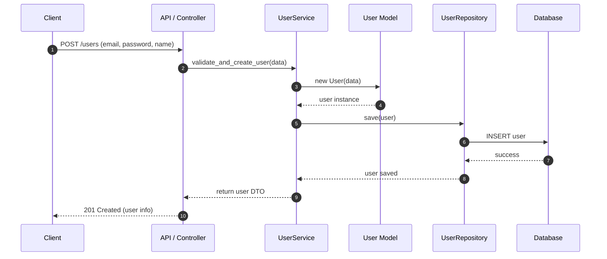

```mermaid
sequenceDiagram
    autonumber
    participant Client
    participant API as API / Controller
    participant Service as UserService
    participant Model as User Model
    participant Repo as UserRepository
    participant DB as Database

    Client->>API: POST /users (email, password, name)
    API->>Service: validate_and_create_user(data)
    Service->>Model: new User(data)
    Model-->>Service: user instance
    Service->>Repo: save(user)
    Repo->>DB: INSERT user
    DB-->>Repo: success
    Repo-->>Service: user saved
    Service-->>API: return user DTO
    API-->>Client: 201 Created (user info)
```